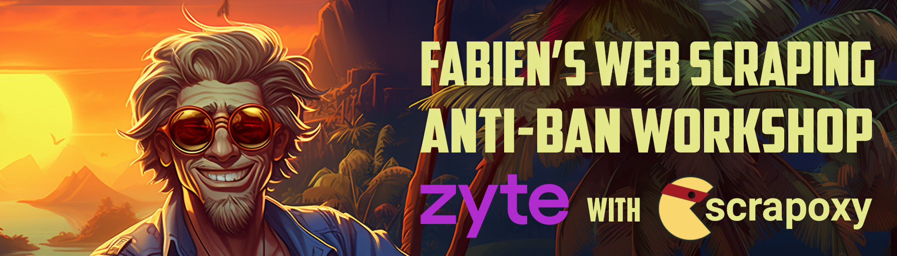
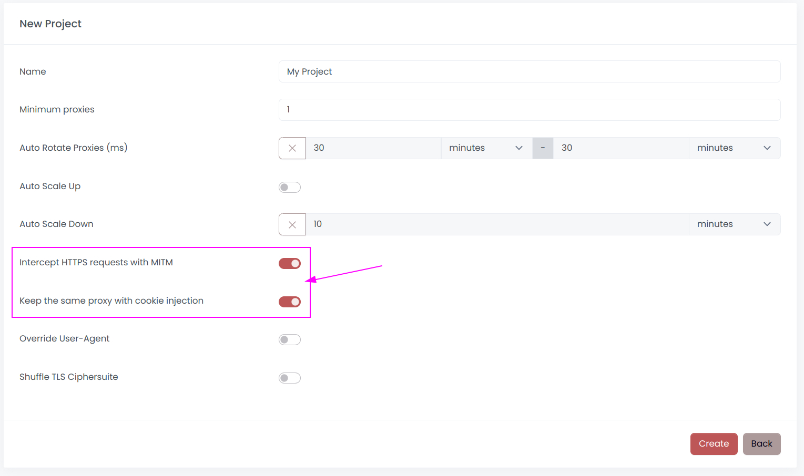
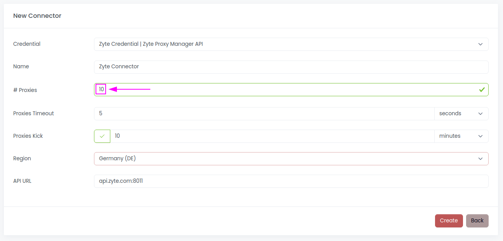
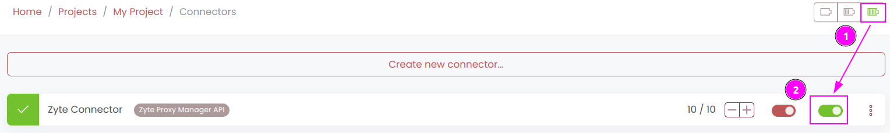
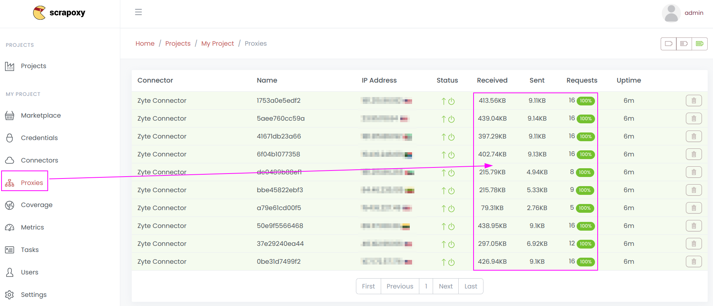
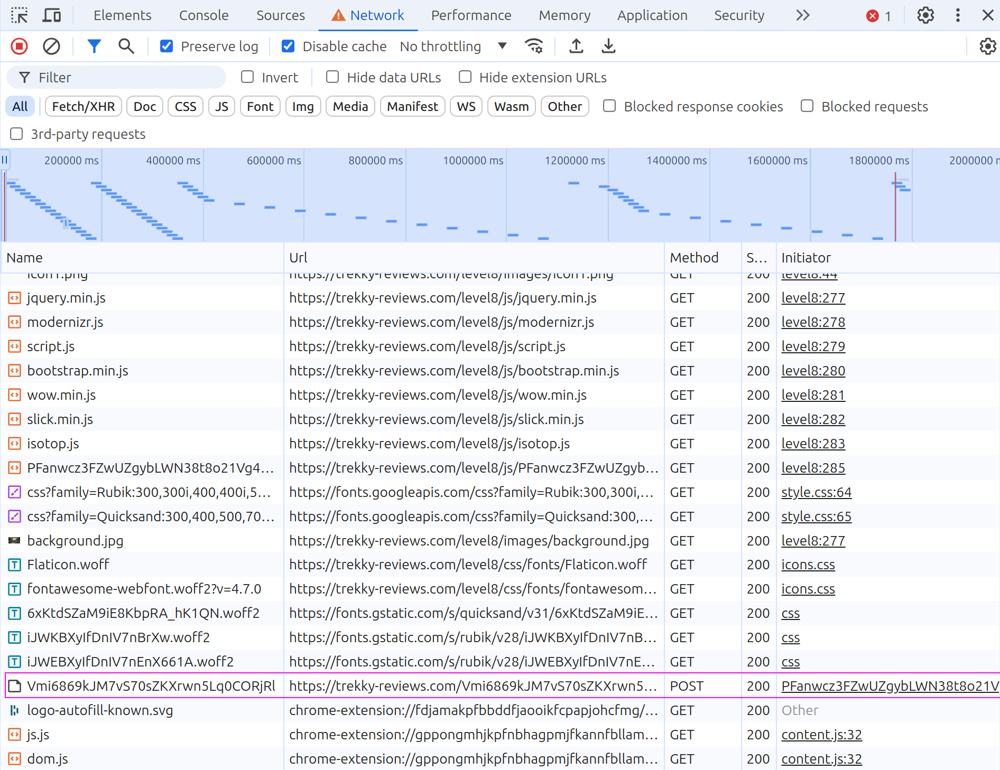
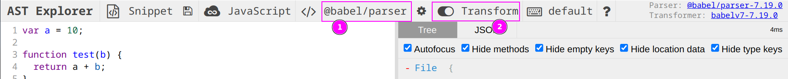
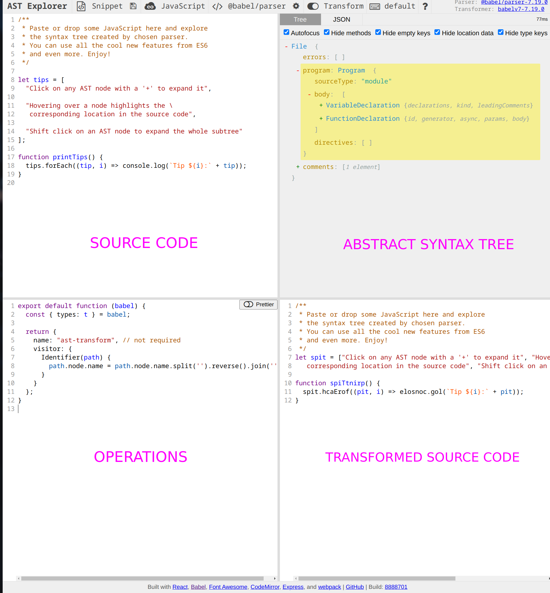

# Fabien's WebScraping Anti-Ban Workshop




## Introduction

Our goal is to understand how anti-bot protections work and how to bypass them.

I created a dedicated website for this workshop [https://trekky-reviews.com](https://trekky-reviews.com).
This website provides a list of hotels for every city, including reviews.

We will collect **name, email and reviews** for each hotel.

During this workshop, we will use the following open-source software:

| Framework                            | Description                                                                  |
|--------------------------------------|------------------------------------------------------------------------------|
| [Scrapy](https://scrapy.org)         | the leading framework for web scraping                                       |
| [Scrapoxy](https://scrapoxy.io)      | the super proxies aggregator                                                 |
| [Babel.js](https://babeljs.io)       | a transpiler used for deobfuscation purposes                                 |

The scraper can be found at [scrapers/spiders/trekky.py](scrapers/spiders/trekky.py).

All solutions are located in [solutions](solutions).
If you have any difficulties implementing a solution, feel free to copy and paste it. 
However, I recommend taking some time to search and explore to get the most out of the workshop, rather than rushing through it in 10 minutes.


## Preflight Checklist

### VirtualBox (Linux and Windows)

To simplify the installation process,
I've pre-configured an Ubuntu virtual machine for you with
all the necessary dependencies for this workshop.

<table>
    <tr>
        <td>
            
        </td>
        <td>
This virtual machine is compatible only with AMD64 architecture (Linux, Windows, and Intel-based macOS).
            
For macOS M1 (ARM64), please manually install the dependencies. 
        </td>
    </tr>
</table>

You can download it **[from this link](https://bit.ly/scwsfiles).**

The virtual machine is in OVA format and can be easily imported into [VirtualBox](https://www.virtualbox.org).

It requires 8 Go RAM and 2 vCPU.

Click on `Import Appliance` and choose the OVA file you downloaded.

Credentials are: `vboxguest / changeme`.

I recommend switching the network setting from NAT to **Bridge Adapter** for improved performance.

_Note: If the network is too slow, I have USB drives available with the VM._


### Full Installation (Linux, Windows, and macOS)

You can manually install the required dependencies, which include:

- Python (version 3 or higher) with virtualenv
- Node.js (version 20 or higher)
- Docker

You can download Node.js from: https://nodejs.org/en/download

For Python, you can use Anaconda: https://www.anaconda.com/download


## Setting up

This step is necessary even if you are using the VM.


### Step 1: Clone the Repository

Clone this repository:

```shell
git clone https://github.com/fabienvauchelles/scraping-workshop-zyte.git
cd scraping-workshop-zyte
```


### Step 2: Install Python libraries

Open a shell and install libraries:

```shell
pip install -r requirements.txt
```


### Step 3: Install Node.js

Install Node.js from the [official website](https://nodejs.org/en/download/) or through the version management [NVM](https://github.com/nvm-sh/nvm)


### Step 4: Install Node.js libraries

Open a shell and install libraries from `package.json`:

```shell
npm install
```


### Step 5: Scrapoxy

Run the following command to download Scrapoxy:

```shell
sudo docker pull fabienvauchelles/scrapoxy
```


## Challenge 1: Run your first Scraper

The URL to scrape is: [https://trekky-reviews.com/level1](https://trekky-reviews.com/level1)

Our goal is to collect **names, emails, and reviews** for each hotel listed.

Open the file [`scrapers/spiders/trekky.py`](scrapers/spiders/trekky.py).

In Scrapy, a spider is a Python class with a unique `name` property. Here, the name is `trekky`.

The spider class includes a method called `start_requests`, which defines the initial URLs to scrape. 
When a URL is fetched, the Scrapy engine triggers a callback function. 
This callback function handles the parsing of the data. 
It's also possible to generate new requests from within the callback function, allowing for chaining of requests and callbacks.

The structure of items is defined in the file [`scrapers/items.py`](scrapers/items.py). 
Each item type is represented by a dataclass containing fields and a loader:

* `HotelItem`: name, email, review with the loader `HotelItemLoader`
* `ReviewItem`: rating with the loader `ReviewItemLoader`

To run the spider, open a terminal at the project's root directory and run the following command:

```shell
scrapy crawl trekky
```

Scrapy will collect data from **50 hotels**:

```text
2024-07-05 23:11:43 [trekky] INFO: 

We got: 50 items

```

Check the `results.csv` file to confirm that all items were collected.


## Challenge 2: First Anti-Bot protection

The URL to scrape is: [https://trekky-reviews.com/level2](https://trekky-reviews.com/level2)

Update the URL in your scraper to target the new page and execute the spider:

```shell
scrapy crawl trekky
```

Data collection may fail due to **an anti-bot system**.

Pay attention to the **messages** explaining why access is blocked and use this information to correct the scraper.

_Hint: It relates to HTTP request headers 😉_

<details>
    <summary>Soluce is here</summary>
    <a href="solutions/challenge-2.py">Open the soluce</a>
</details>


## Challenge 3: Rate limit

The URL to scrape is: [https://trekky-reviews.com/level4](https://trekky-reviews.com/level4) (we will skip level3)

Update the URL in your scraper to target the new page and execute the spider:

```shell
scrapy crawl trekky
```

Data collection might fail due to **rate limiting** on our IP address.

<table>
    <tr>
        <td>
            
        </td>
        <td>
            Please don't adjust the delay between requests or the number of concurrent requests; <b>that is not our goal</b>. 
            Imagine we need to collect millions of items within a few hours, and delaying our scraping session is not an option. 
            Instead, we will use proxies to distribute requests across multiple IP addresses.
        </td>
    </tr>
</table>

Use [Scrapoxy](https://scrapoxy.io) to bypass the rate limit with the Zyte API (Proxy Mode).


### Step 1: Install Scrapoxy

Follow this [guide](https://scrapoxy.io/intro/get-started) or run the following command in the project directory:

```shell
sudo docker run -p 8888:8888 -p 8890:8890 -e AUTH_LOCAL_USERNAME=admin -e AUTH_LOCAL_PASSWORD=password -e BACKEND_JWT_SECRET=secret1 -e FRONTEND_JWT_SECRET=secret2 -e STORAGE_FILE_FILENAME=/scrapoxy.json -v ./scrapoxy.json:/scrapoxy.json fabienvauchelles/scrapoxy:latest
```


### Step 2: Create a new project

It's important to keep the **same IP address** consistent throughout the session.
Scrapoxy offers a **sticky session** feature for this purpose.

When setting up a new project, ensure that both `Intercept HTTPS requests with MITM` 
and `Keep the same proxy with cookie injection` are enabled:




### Step 3: Add Zyte API (Proxy Mode)

Use [this guide](https://scrapoxy.io/connectors/zyte/guide) to create a new connector.

Use **10 proxies** from Europe (GB, Germany, ...).




### Step 4: Run the connector




### Step 5: Connect Scrapoxy to the spider

Follow this [guide](https://scrapoxy.io/integration/python/scrapy/guide).


### Step 6: Execute the spider

Run your spider and check that Scrapoxy is handling the requests:



You should observe an increase in the count of received and sent requests.

<details>
    <summary>Soluce is here</summary>
    <a href="solutions/challenge-3.py">Open the soluce</a>
</details>


## Challenge 4: Deobfuscation

The URL to scrape is: [https://trekky-reviews.com/level8](https://trekky-reviews.com/level8) (we will skip level5, level6 and level7)

Update the URL in your scraper to target the new page and execute the spider:

```shell
scrapy crawl trekky
```

### Step 1: Find the Anti-Bot Javascript

Use the **Network Inspector** to review all requests.
Among them, you'll spot some unusual ones. 
By inspecting the payload, you'll notice that the content is **encrypted**:



Inspect the website's code to find the JavaScript responsible for sending this requests.
In this case, the source code is obfuscated.

Obfuscated code appears to be:

```javascript
var _qkrt1f=window,_uqvmii="tdN",_u5zh1i="UNM",_p949z3="on",_eu2jji="en",_vnsd5q="bto",_bi4e9="a",_f1e79r="e",_w13dld="ode",_vbg0l7="RSA-",_6uh486="ki"...
```

To understand which information is being sent and how to emulate it, we need to **deobfuscate the code**.


### Step 2: Deobfuscate the Javascript

Copy/paste the source code of this obfuscated script to `tools/obfuscated.js`.

And run the deobfucator script:

```shell
node tools/deobfuscate.js
```

This script currently doesn't perform any operations.
Our goal is to add [AST](https://en.wikipedia.org/wiki/Abstract_syntax_tree) operations to transform and deobfuscate the code.

<table>
    <tr>
        <td width="70">
            <image src="images/note.png">
        </td>
        <td>
            Of course, you can use <a href="https://obf-io.deobfuscate.io">online tools</a> to deobfuscate this script,
given that it's a straightforward obfuscated script. 
            However, our focus is to understand how Babel can be used for deobfuscation.
        </td>
    </tr>
</table>

<table>
    <tr>
        <td width="70">
            <image src="images/info.png">
        </td>
        <td>
            <a href="https://github.com/features/copilot">GitHub Copilot</a>
            can be incredibly helpful in writing AST operations, just as
            <a href="https://claude.ai">Claude Sonnet 3.5</a>
            is valuable for deciphering complex functions.
        </td>
    </tr>
</table>

To understand the structure of the code, copy/paste some code into the website [AST Explorer](https://astexplorer.net)

Don't forget to select `@babel/parser` and enable `Transform`:



AST Explorer parses the source code and generates a visual tree:



<table>
    <tr>
        <td width="70">
            <image src="images/info.png">
        </td>
        <td>
            For the record, I only obfuscated strings, not the code flow.
        </td>
    </tr>
</table>

Now, you can implement the 3 AST operations:

* **Constant Unfolding**: replace all constants with their respective string values;
* **String Join**: combine strings that have been split into multiple parts;
* **Dot Notation**: convert string notation into dot notation.

<details>
    <summary>Soluce is here</summary>
    <a href="solutions/challenge-4.js">Open the soluce</a>
</details>


## Challenge 5: Payload generation

Here’s a summary of the script’s behavior:

1. It collects **WebGL information**;
2. It encrypts the data using **RSA encryption** with an obfuscated public key;
3. It sends the payload to the webserver via a **POST request**.

We need to implement the same approach in our spider.

Since we will be crafting the payload ourselves, there is **no need** to use Playwright anymore. 
We will simply send the payload **before** initiating any requests.

You can use the Python's `Crypto` and `base64` libraries:

<table>
    <tr>
        <td width="70">
            <image src="images/note.png">
        </td>
        <td>
            <ul>
                <li>
                    Crypto.RSA.importKey requires a PEM key format such as:<br/>
                    <code>-----BEGIN PUBLIC KEY-----<br/>
MY_PUBLIC_KEY<br/>
-----END PUBLIC KEY-----</code>
                </li>
                <li>RSA uses OAEP</li>
                <li>Don't forget the SHA256 signature</li>
            </ul>
        </td>
    </tr>
</table>

If you need help, you can refer to the partial solution located in [solutions/challenge-5-1-partial.py](solutions/challenge-5-1-partial.py).

<details>
    <summary>Soluce is here</summary>
    <a href="solutions/challenge-5-2.py">Open the soluce</a>
</details>


## Conclusion

Thank you so much for participating in this workshop.

Your feedback is incredibly valuable to me. 
Please take a moment to complete this survey; your insights will greatly assist in enhancing future workshops:

👉 [GO TO SURVEY](https://bit.ly/scwsv) 👈


## Licence

WebScraping Anti-Ban Workshop (Zyte) © 2024 by [Fabien Vauchelles](https://www.linkedin.com/in/fabienvauchelles) is licensed under [CC BY-NC-ND 4.0](https://creativecommons.org/licenses/by-nc-nd/4.0/?ref=chooser-v1):

* Credit must be given to the creator;
* Only noncommercial use of your work is permitted;
* No derivatives or adaptations of your work are permitted.

